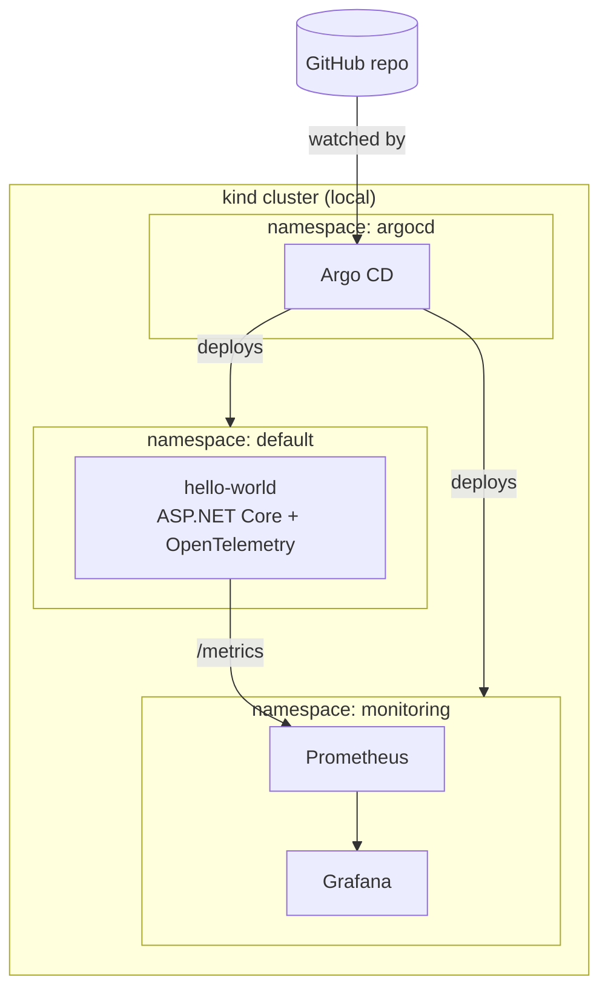

# dotnet-on-k8s

> ASP.NET Core workloads on Kubernetes — a portfolio project documenting
> the journey from .NET developer to Platform Engineer.

## What this is

A hands-on portfolio project documenting the transition from Senior .NET Developer
to Platform Engineer. Each milestone introduces a new layer of the platform stack:

- **M1** — ASP.NET Core app deployed on local Kubernetes (kind)
- **M2** — Helm chart + Argo CD (GitOps)
- **M3** — Observability: Prometheus, Grafana, OpenTelemetry
- **M4** — PostgreSQL on Kubernetes with persistent storage
- **M5** — Terraform module published to registry.terraform.io

## Architecture



**Current stack:**
- Runtime: .NET 10 / ASP.NET Core
- Container: Docker (multi-stage build)
- Orchestration: Kubernetes (kind)
- Packaging: Helm
- GitOps: Argo CD
- Observability: Prometheus + Grafana (kube-prometheus-stack), OpenTelemetry SDK
- Local tooling: kubectl, helm, k9s

## Prerequisites

- [Docker](https://docs.docker.com/engine/install/)
- [kind](https://kind.sigs.k8s.io/docs/user/quick-start/)
- [kubectl](https://kubernetes.io/docs/tasks/tools/)
- [Helm](https://helm.sh/docs/intro/install/)
- [.NET 10 SDK](https://dotnet.microsoft.com/download)

## Quick Start

Clone the repository:
```bash
git clone https://github.com/mikolaj-k/dotnet-on-k8s.git
cd dotnet-on-k8s
```

Create the cluster:
```bash
kind create cluster --name dotnet-on-k8s
```

Build and load the application image:
```bash
docker build -t hello-world:v2 src/HelloWorld/
kind load docker-image hello-world:v2 --name dotnet-on-k8s
```

Install Argo CD:
```bash
kubectl create namespace argocd
kubectl apply -n argocd -f https://raw.githubusercontent.com/argoproj/argo-cd/stable/manifests/install.yaml
```

Deploy all applications via Argo CD (hello-world + kube-prometheus-stack):
```bash
kubectl apply -f argocd/hello-world-app.yaml
kubectl apply -f argocd/kube-prometheus-stack-app.yaml
```

Access Argo CD UI:
```bash
kubectl port-forward -n argocd service/argocd-server 8081:443
# https://localhost:8081
# username: admin
# password: kubectl -n argocd get secret argocd-initial-admin-secret -o jsonpath="{.data.password}" | base64 -d
```

Access Grafana:
```bash
kubectl port-forward -n monitoring service/kube-prometheus-stack-grafana 3000:80
# http://localhost:3000
# username: admin / password: admin
```

Verify the application:
```bash
kubectl port-forward service/hello-world 8080:80
curl http://localhost:8080/weatherforecast
curl http://localhost:8080/metrics
```

## Project Structure

```
dotnet-on-k8s/
├── src/
│   └── HelloWorld/                   # ASP.NET Core application
│       ├── Dockerfile                # Multi-stage build (net10.0)
│       ├── HelloWorld.csproj
│       └── Program.cs                # OpenTelemetry + Prometheus exporter
├── charts/
│   └── hello-world/                  # Helm chart
│       ├── Chart.yaml
│       ├── values.yaml
│       └── templates/
│           ├── deployment.yaml
│           ├── service.yaml
│           └── servicemonitor.yaml   # Prometheus scrape config
├── argocd/                           # Argo CD Application manifests
│   ├── hello-world-app.yaml
│   └── kube-prometheus-stack-app.yaml
└── docs/
    └── adr/                          # Architecture Decision Records
        ├── ADR-001-local-kubernetes-kind.md
        ├── ADR-002-helm-over-raw-yaml.md
        └── ADR-003-argocd-for-gitops.md
```

## Architecture Decision Records

| ADR | Decision | Status |
|-----|----------|--------|
| [ADR-001](docs/adr/ADR-001-local-kubernetes-kind.md) | Local Kubernetes: kind over minikube/k3d | Accepted |
| [ADR-002](docs/adr/ADR-002-helm-over-raw-yaml.md) | Helm over raw YAML / Kustomize | Accepted |
| [ADR-003](docs/adr/ADR-003-argocd-for-gitops.md) | Argo CD for GitOps | Accepted |

## Roadmap

- [x] M1 — ASP.NET Core on local Kubernetes (kind)
- [x] M2a — Helm chart
- [x] M2b — Argo CD (GitOps)
- [x] M3a — kube-prometheus-stack deployed via Argo CD
- [x] M3b — OpenTelemetry metrics in .NET app + ServiceMonitor
- [ ] M3c — Custom Grafana dashboard for application metrics
- [ ] M4 — PostgreSQL on Kubernetes with persistent storage
- [ ] M5 — Terraform module published to registry.terraform.io

## Author

Mikołaj Klimas — Senior .NET Developer transitioning to Platform Engineering.

- GitHub: [@mikolaj-k](https://github.com/mikolaj-k)